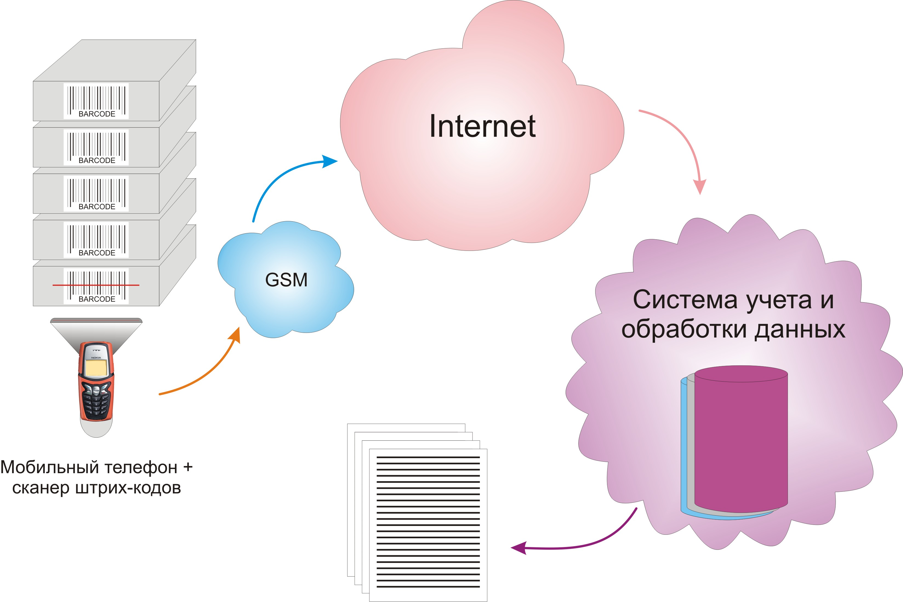
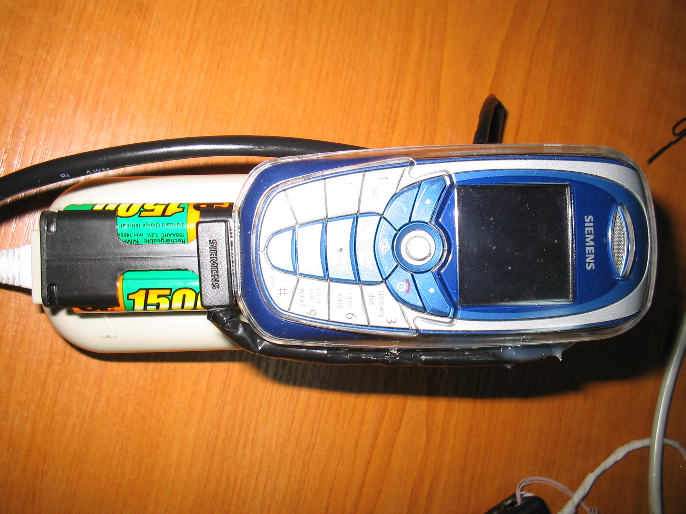
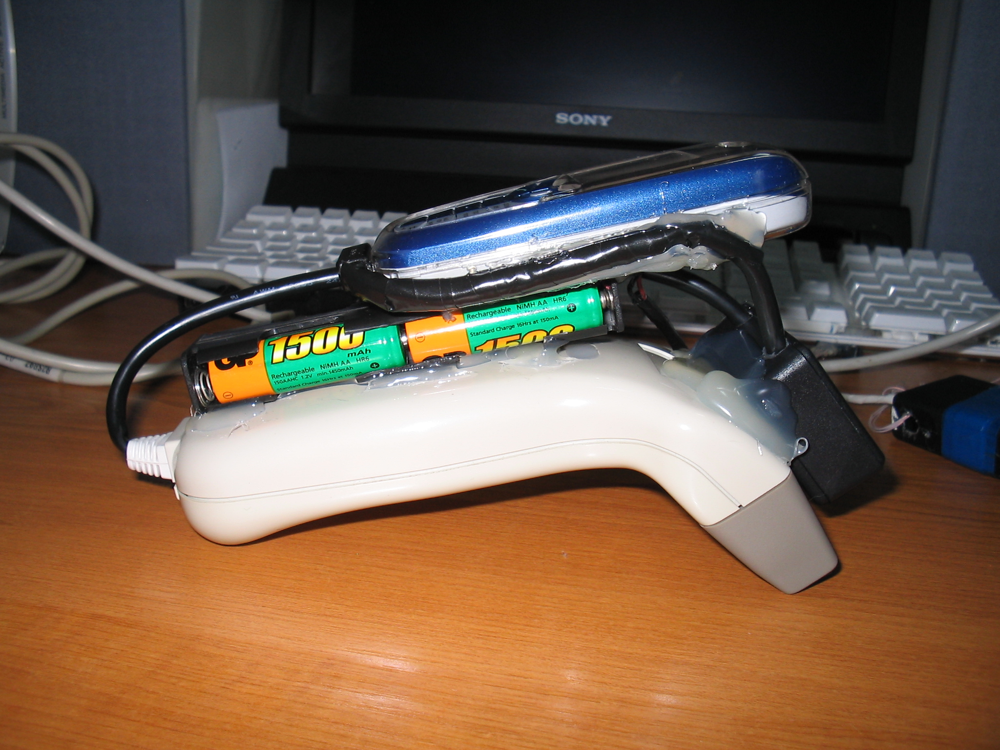
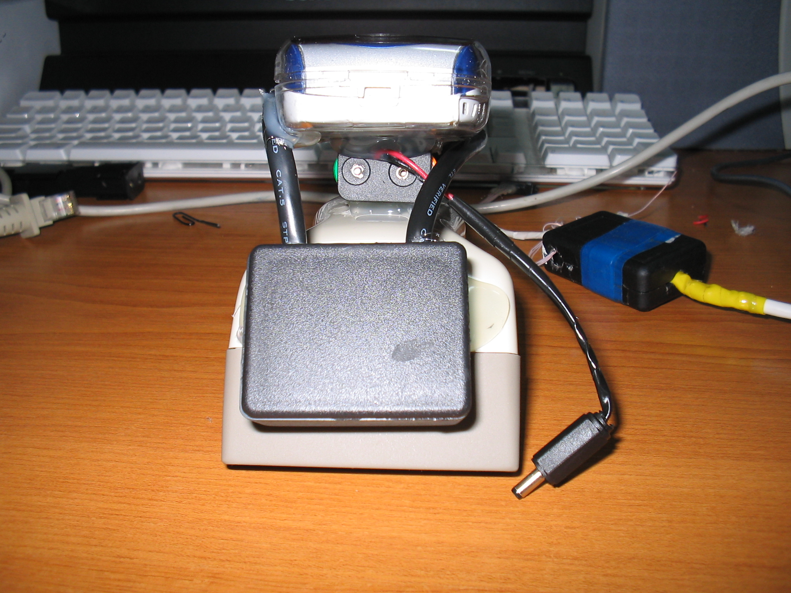
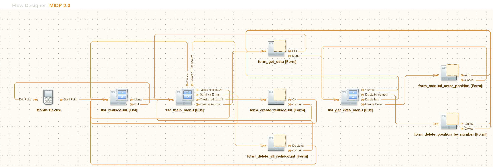

# Project from 2007
I've uploaded it just to not to forget my effort.  
Все права принадлежат **Олегу Мищенко** и **Машеньке**.  
Использовались для продажи на точках с кошельками, перчатками, сумками, ёлками ...   

## Main idea: controlling of selling stuff from trade points.
This project was created with next inputs:  
* big assortment
* big quantity
* no possibility to write/control each sold stuff
* possible to control what you have added 
* possible to count all the stuff (rediscount) once per some period of time ( week/two-weeks/month )
* possible to see what should be on each sell point
* possible to work in full haos ))))

## Implementation
  
  
  
  
  

## Parts
* Program 
  > Delphi application for Warehouse to control all the sell-points  
* MIDlet
  > J2ME application for mobile phone ( yes, yes, idea was from 2006 !!! )  
    